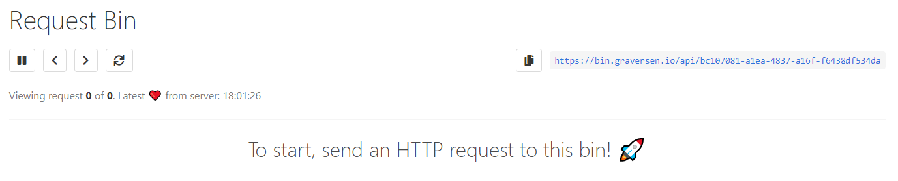

# Request Bin

Web Request Bin 🗑️ made with React (w/ Hooks and SSE), Spring WebFlux, Cassandra, and MySQL. Deployment 🐳 using Docker multistage builds in Compose environment. 

In seeking deeper understanding of how one might deliver a "full stack" application with real, portable deployment, this project was born.

I also wanted something that may become useful at times, and something that makes sense to actually deploy. So here we are!

**Avilable at:** https://bin.graversen.io

## Primary Challenges Solved
* Real project using Spring WebFlux, Reactive Repositories, and multi-subscriber SSE
* React app, with Hooks, as part of the deliverable
* Create a CLI to "reverse proxy" SSE streams to localhost (or other!) target
* Continuous delivery pipeline using [Docker Multistage Build](https://docs.docker.com/develop/develop-images/multistage-build/) pattern

## Secondary Challenges Solved
* Make a somewhat mobile-friendly UI
* Use SASS to "compile" CSS
* Use Spring Profile for dev/production
* Establish the whole deployment (Reverse proxy configuration, SSL certificate, DNS, etc.)

## Components

### `server`
The `server` directory is Java 11 backend running various Spring Boot and Spring Framework modules, which facilitates the management of "bins", streaming then using SSE based on Spring WebFlux, and backed by MySQL 8 and Cassandra 3 storage.

### `relay-server`
A command-line tool to "reverse proxy" a stream from an established bin, to a target of your choice.

Useful to relay transmission of HTTP requests through mixed networks, e.g. from inside a Docker network to an endpoint not part of the Docker UDN.

### `client`

The frontend, based on React, using Hooks to manage SSE streaming through the DOM's `EventStream` object. The UI is based on Bulma CSS, compiled from SASS.

## Installation

Since the *Docker Multistage Build* pattern is used, installing from source is as simple as:

```
docker-compose -f docker-compose-production-build.yml up --build -d
```

## System Overview

The system is composed (hehe!) of a React app served statically through an Nginx, with a Java 11 / Spring Framework 5.1 backend, proxied through the same Nginx.

The Nginx sits on the outer layer of the Docker-Compose UDN (as illustrated below).


I wanted to explore the *Docker Multistage Build* pattern, as a way of containerizing the entire CD lifecycle of an application.  
The *Docker Multistage Build* pattern helps separate the build dependencies from the release dependencies.

**[For the backend](https://github.com/MrGraversen/request-bin/blob/master/server/Docker/Dockerfile)**, this means that you for example don't need the JDK to run the Java app. Only the JRE is necessary. The image comes out at **263 MB**. In a future where weekends are more plentiful, this could be slimmed down even further with the usage of the *Java Module System*.

**[For the frontend](https://github.com/MrGraversen/request-bin/blob/master/client/Docker/Dockerfile)**, it allows you to discard all build artifacts, e.g. `node_modules`, NodeJS itself, and so on. In the end, it is just static HTML, CSS, and JS, served through Nginx. The image comes out at just **22.5 MB**.

## UI

*These are just in case I decide to longer expose the service publicly.*




